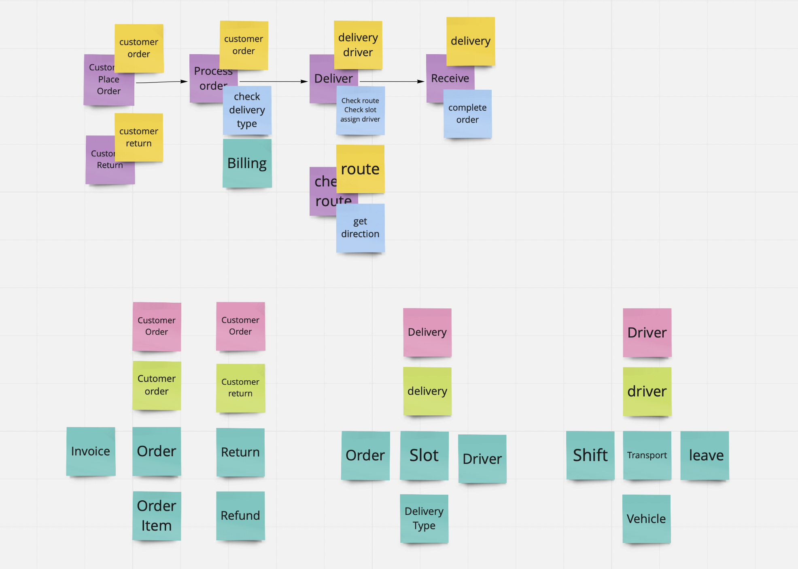

# Building MicroServices
การสร้าง MicroServices ด้วย Greenfield Approach(ไม่เคยมีระบบเดิมมาก่อน) ดังนั้นเราจะเริ่มต้นด้วยขั้นตอนต่างๆ ดังนี้

## Steps to implement MicroServices
1. Bounded Context (Analysis and Design)
1. Create Contract
1. Mocking Services
1. Implementing Service (Coding)
1. Testing
1. Deploy

### Bounded Context
สร้าง Flow การทำงานก่อนด้วย post-it สีม่วง แล้วใส่ application services (สีฟ้า) ที่ต้องมีเข้าไป สุดท้ายจับรวม services ต่างๆเข้าไปอยู่ใน context ด้วย post-it สีเหลือง
- Context
- Core Concept
- Supporting Concept

ผลลัพธ์ที่ได้

### Create Contract (Contract Driven Development)
นำ Supporting Concept(สีฟ้า) มาสร้าง contract ซึ่ง contract มี 3 รูปแบบ ดังนี้ 
- apiblueprint (Design first)
- openAPI (Code first)
- RAML

### Mocking service
เมื่อเราได้่ Contract มาแล้วเราสามารถนำ Contract นั้นมาสร้าง Mockup หรือ API ตัวปลอมๆ ขึ้นมาได้ด้วยเครื่องมือต่างๆ ดังนี้

* Mocking apiblueprint
    * drakov
    * snowboard

* Mocking openAPI
    * prism

* Mocking แบบไม่มี contract (ใช้ในกรณีที่เราต้องคุยกับ services ที่ยังไม่มี contract หรือ services ภายนอก)
    * json-server

> [Module 1 Mocking Service](01-Mocking-Service)

### Testing in MicroServices
#### Unit Testing
สร้าง unit test และ run unit test เพื่อทดสอบการทำงานในทุกๆ function

#### Contract Test
การสร้าง contract ต้องมั่นใจว่าตรงกับ API จริงๆ ดังนั้นต้องมีการทดสอบ contract อยู่เสมอเพื่อให้มั่นใจว่าเรา API ที่สร้่างขึ้นกับ contract ที่ประกาศไว้นั้นยังตรงกันอยู่จึงเป็นที่มาของ contact test
* dredd
* pact
* postman

#### Integration Test (API Testing)
เมื่อเราสร้าง API ขึ้นมาแล้ว จะยังไม่สามารถทำทุกอย่างให้เสร็จภายใน service เดียวได้ เพราะเรากำลังสร้าง MicroServices ดังนั้นเราเลยต้องทำการทดสอบการทำงานร่วมกับ service อื่นๆ ด้วยเครื่องมือต่างๆ ดังนี้
* Postman + newman (Recommend)
* Soap UI

> [Module 2 API Testing](02-API-Testing)

### Caching with Redis
> [Module 3 Caching with Redis](03-Redis-Server)

### Communication with RabbitMQ
> [Module 4 Communication with RabbitMQ](04-Message-Queue)

### Running Application with Docker
> [Module 5 Deployment with Docker](05-Docker-and-Docker-compose)

### Deploy Application to Kubernetes Cluster
#### Create a Kubernetes Service
> [Module 6 Kubernetes Service](06-Kubernetes-Service)

#### Managing traffic with Kubernetes Ingress
> [Module 7 Kubernetes Ingress](07-Kubernetes-Ingress)

#### Managing storage
> [Module 8 Kubernetes Storage](08-Kubernetes-Storage)
